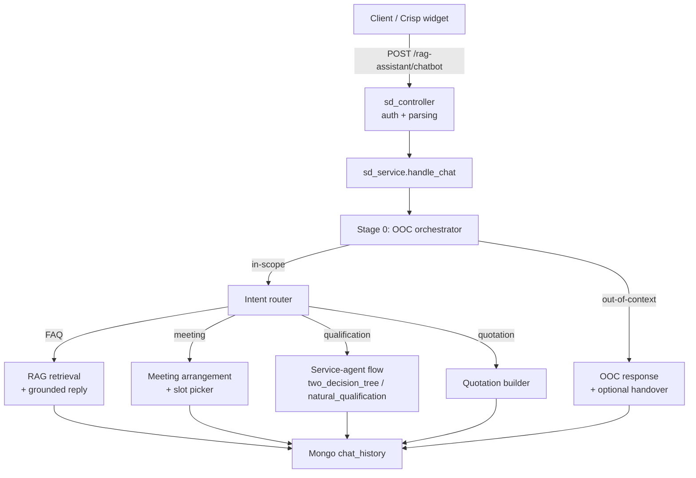
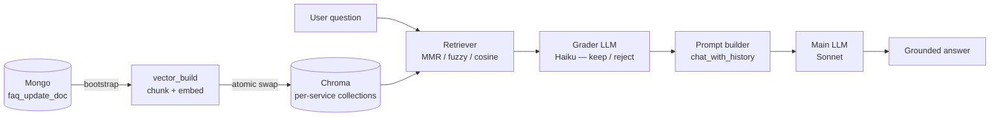

# RAG Assistant — Multi-Intent Customer Chatbot

A production-grade Retrieval-Augmented Generation chatbot that answers customer questions from a grounded knowledge base, books sales meetings, and hands off to human agents when the request is out of scope. Built with LangGraph, Claude, ChromaDB, and FastAPI/Flask.

> **Portfolio note:** This is a sanitized public mirror of a real production chatbot. The brand, knowledge-base content, and customer data have been replaced with synthetic examples for a fictional company called "Acme Services". The engineering is unchanged.

---

## What it does (plain language)

Imagine you run a B2B services business and your website chat receives the same kinds of questions every day — "what do you offer?", "how much does X cost?", "can I book a call?" and a long tail of off-topic questions. This system handles those conversations automatically:

- **Answers FAQs accurately** using only your own knowledge base (no made-up facts — every answer is grounded in retrieved documents).
- **Schedules sales meetings** by checking real calendar availability and proposing time slots.
- **Hands off to a human** when a question is sensitive, out of scope, or the customer asks for one.
- **Speaks the customer's language** — works in English, Indonesian, Malay, Thai, Vietnamese, and ten more locales.

The result is a chat surface that is on-message, doesn't hallucinate, and routes complex cases to people instead of bluffing.

## Key features

- **Multi-intent routing** — every turn is classified as FAQ / meeting / service-agent (qualification) / out-of-context / quotation, then dispatched to a dedicated handler.
- **Grounded FAQ retrieval** — per-service ChromaDB collections, MMR / fuzzy / cosine anti-redundancy retrieval, anti-hallucination grader.
- **Natural meeting scheduling** — proposes slots from a real availability API, confirms by writing to MongoDB and (optionally) Google Sheets.
- **Stateful service qualification** — two pluggable flows: structured decision-tree and natural-conversation single-agent. Both persist field-by-field progress per session.
- **Out-of-context engine** — 14-category classifier × 5 response shapes, locale-aware, with an escalation-to-human ladder.
- **Multilingual** — centralized i18n loader, schema-driven translation registry across 15 locale YAMLs.
- **Production observability** — every LLM call is wrapped in an audit context manager that writes prompt, response, latency, and tokens to MongoDB with a per-turn correlation ID.

## Architecture

### High-level request flow



### RAG pipeline



## How it works

1. **Auth + parsing.** A Flask controller (`sd_controller.py`) validates an API key, resolves the session token to a Crisp or local session, and parses the JSON body.
2. **Stage 0 OOC orchestrator** (`sd_orchestrator.py`) checks for abandonment cues, detects language, and runs the 14-category out-of-context classifier. If matched, the OOC service renders a locale-appropriate response and increments per-session counters; consecutive OOC turns escalate to a human handover.
3. **Intent routing.** In-scope turns are routed by `sd_service.handle_chat` to one of FAQ-RAG / meeting-arrangement / service-agent / quotation.
4. **RAG retrieval** (`sd_vector_repo.py`) hits ChromaDB. Two modes: an unbiased top-N for unknown service, or a service-biased retrieval with cross-service backfill once a service is picked. An anti-redundancy filter (MMR, fuzzy token-set, or cosine — configurable per env knob) drops near-duplicate chunks compared against the recent-chunk-IDs window.
5. **Grading.** Each retrieved chunk is graded by a cheap Haiku LLM; rejected chunks are removed, and a floor backfill keeps the context size stable.
6. **Prompt build + main call.** Conversation history is summarised by an async job (`SUMMARY_ASYNC`) and clipped to fit. The grounded prompt goes to Claude Sonnet.
7. **Audit + persist.** Every LLM call is wrapped in an `audit_llm_call` context manager that records prompt, response, latency, and tokens to MongoDB. The turn's `chat_history` document is upserted with the rendered response and routing metadata.

## Engineering highlights

These are the points worth showing as a portfolio:

- **~5× LLM cost optimization.** Split the workload across Claude Sonnet (main reasoning) and Claude Haiku (the binary-classifier grader) via a per-stage `GRADER_MODEL` env override. Same retrieval quality, ~5× fewer Sonnet tokens.
- **Production CPU-OOM fix.** Eliminated a recurring OOM crash by introducing a single source of truth for device resolution (`core/gpu_config.py:resolve_device`) and a GPU passthrough path in `docker-compose.yml` (NVIDIA driver capabilities + device_requests).
- **Anti-redundancy retrieval.** Three pluggable strategies (MMR, fuzzy token-set, cosine) over a rolling recent-chunk-IDs window. In QA, redundant-chunk count went from ~11 per 3-turn flow to 0 with MMR + recap-bypass.
- **Per-service vector store split.** Migrated from a single Chroma collection to N per-service collections with a feature-flagged dual-mode (legacy + split) for safe rollout, divergence telemetry, and zero-downtime swap.
- **Stage 0 OOC engine.** 14-category classifier (keyword / hybrid / LLM modes) × 5 response shapes (cold_start, mid_flow_standard, mid_flow_high_stakes, mid_flow_pre_data, escalation_handover). Centralized i18n loader replaced 13 scattered palette dicts.
- **Forensic LLM auditing.** A per-turn correlation ID threads through every nested `audit_llm_call`, writing rows to a dedicated MongoDB `audit_llm` collection. Method B (natural qualification) also serializes the per-turn prompt log into `chat_history.prompt_applied` so debugging never requires a cross-collection join.
- **Test coverage.** 36 pytest modules cover the OOC engine, redundancy filters, retrieval strategies, i18n schema, meeting-picker boundaries, and per-service vector build/registry.

## Tech stack

- **Python 3.12** — FastAPI + Flask (two-entrypoint architecture: `main.py` for admin/ingestion, `modules/system_detection/chatbot.py` for the user-facing chatbot)
- **LangChain + LangGraph** — orchestration
- **Claude (Anthropic)** — main reasoning (Sonnet) and grading (Haiku)
- **OpenAI embeddings** or **HuggingFace SentenceTransformers** — pluggable per env
- **ChromaDB** — vector store (per-service collections with atomic swap)
- **MongoDB** — chat history, FAQ source, audit log
- **APScheduler** — token lifecycle, sales-slots updater
- **Docker** (CUDA + CPU variants), **Modal** (optional serverless GPU)
- **pytest** — test suite
- **GitLab CI** (provided as `.gitlab-ci.yml.example`) for the original deployment pipeline

## Project structure

```
.
├─ main.py                          FastAPI admin app (FAQ ingest + SSU scheduler)
├─ modal_app.py                     Modal serverless wrapper (optional)
├─ core/
│  ├─ app_config.py                 Single Config dataclass — every env key
│  ├─ app_audit.py                  audit_llm_call + per-turn capture buffer
│  └─ gpu_config.py                 Centralized device resolution
├─ modules/
│  ├─ system_detection/             User-facing chatbot Flask app
│  ├─ service_agent/                Qualification flows (decision-tree + natural)
│  ├─ out_of_context/               Stage 0 OOC engine
│  ├─ i18n/                         Translation registry + schema
│  ├─ faq_automation/               Mongo ingestion + per-service repo
│  ├─ vector_build/                 Chroma build + atomic swap
│  ├─ meeting_arrangement/          Slot picker + booking writer
│  ├─ late_response_followup/       Re-engagement job
│  ├─ chat_with_history/            History compaction for prompt building
│  ├─ chat_testing_ui/              Browser QA harness
│  └─ token_generate/               Session + token issuance
├─ data/sample_faq/                 Synthetic FAQ for demo (this folder is portfolio-only)
├─ docs/                            ARCHITECTURE.md, ops/, modules/, api/
├─ tests/                           pytest suite (36 modules)
├─ qa/                              QA orchestrator + Excel report builder
├─ .env.example                     Every env key the app reads
├─ Dockerfile.prod                  Multi-stage CUDA + CPU build
└─ docker-compose.yml               GPU-aware compose
```

## Setup & run

1. **Clone + virtualenv**
   ```bash
   git clone <this-repo>
   cd ai-chatbot-public
   python -m venv .venv && source .venv/bin/activate   # Windows: .\.venv\Scripts\activate
   pip install -r requirements.cpu.lock   # or requirements.cuda.lock on GPU hosts
   ```
2. **Configure env** — copy `.env.example` to `.env` and fill the required keys at minimum:
   - `ANTHROPIC_API_KEY` (or `CLAUDE_API_KEY`) — Claude
   - `OPENAI_API_KEY` — only if `EMBEDDINGS_PROVIDER=openai` (the default)
   - `API_KEY`, `SERVICE_AGENT_API_KEY` — generate with `python generate_api_key.py`
   - `MONGO_URI`, `MONGO_DB`
3. **Load sample FAQ** — see `data/sample_faq/README.md`. In short: load `acme_services.json` into Mongo `faq_update_doc`, then `POST /rag-assistant/knowledgebase-rebuild` (with `x-api-key`) to rebuild Chroma.
4. **Run**
   ```bash
   # FastAPI admin + FAQ ingest
   uvicorn main:app --host 0.0.0.0 --port 2303 --reload
   # User-facing chatbot (Flask)
   python -m modules.system_detection.chatbot
   ```
5. **Docker (GPU host)**
   ```bash
   docker compose up rag_chatbot   # builds runtime_cuda by default
   ```
6. **CPU fallback** — set `RAG_FLAVOR=cpu` in `.env` and `USE_GPU=false`.

See `docs/ops/deployment.md` for the full deploy guide, and `docs/ops/env_reference.md` for every env key.

## Testing

```bash
pip install -r requirements-dev.txt
pytest                                # all tests
pytest tests/test_redundancy_filter.py    # one suite
pytest qa/scripts/run_qa_suite.py --help  # QA harness (4-method anti-redundancy comparison)
```

The QA harness runs pytest four times (once per redundancy method), aggregates JSONL results, and writes a comparison Excel report. See `qa/README.md`.

## What I built / skills demonstrated

- **End-to-end ownership** — architected and implemented the full stack from API entrypoints through retrieval, prompting, and observability.
- **Production-grade LangGraph application** — multi-intent routing with stateful per-session flow management.
- **RAG engineering** — chunking, per-service collections, MMR/fuzzy/cosine anti-redundancy, retrieval grading.
- **LLM cost optimization** — per-stage model selection (Sonnet/Haiku), prompt sizing, async history summarization.
- **i18n at scale** — schema-driven translation registry across 15 locales with a typed loader.
- **Observability** — per-turn correlation IDs, async audit writer, prompt/response capture with truncation knobs.
- **DevOps** — multi-stage CUDA Docker, Modal serverless option, GitLab CI deployment pipeline, atomic vector-store swap.
- **Testing discipline** — 36 pytest modules covering classifier behaviour, redundancy filters, retrieval correctness, i18n schema, and meeting-picker boundary cases.

## Disclaimer

This is a sanitized portfolio version of a real production chatbot. The brand name "Acme Services" and all FAQ content, customer data, contact details, phone numbers, and email addresses are placeholders. Real credentials, the original knowledge base, and customer conversation history have been removed or replaced with synthetic examples. Engineering structure and algorithms are unchanged.

## License

MIT — see [LICENSE](LICENSE).
